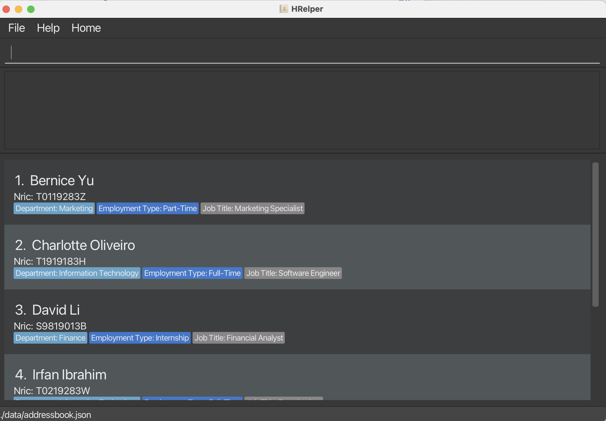
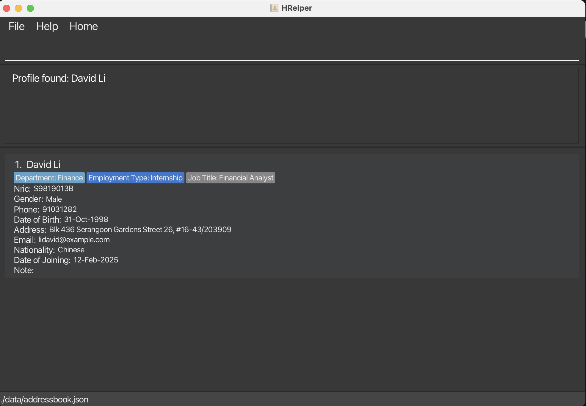

# HRelper

* This project is based on the **AddressBook-Level3 project** created by the [SE-EDU initiative](https://se-education.org). 
  Example usages:
  * as a starting point of a course project (as opposed to writing everything from scratch)
  * as a case study
* The project simulates an ongoing software project for a desktop application (called _AddressBook_) used for managing contact details.
  * It is **written in OOP fashion**. It provides a **reasonably well-written** code base **bigger** (around 6 KLoC) than what students usually write in beginner-level SE modules, without being overwhelmingly big.
  * It comes with a **reasonable level of user and developer documentation**.
* It is named `HRelper`, and it is specially designed for HRs of companies, to enable HRs to quickly access and manage employee and job seeker information, streamlining recruitment and communication within the company.
* For the detailed documentation of this project, see the **[Address Book Product Website](https://se-education.org/addressbook-level3)**.
* This project is a **part of the se-education.org** initiative. If you would like to contribute code to this project, see [se-education.org](https://se-education.org/#contributing-to-se-edu) for more info.
🐌
