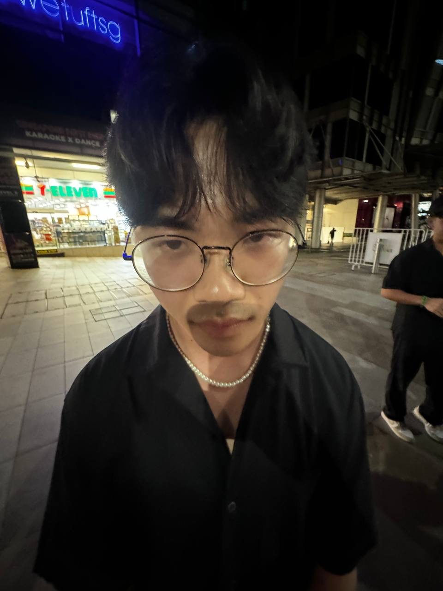

We are a team based in the [School of Computing, National University of Singapore](https://www.comp.nus.edu.sg).

You can reach us at the email `seer[at]comp.nus.edu.sg`

## Project team

### Chen Xiangrui

[[github](https://github.com/chen-xiangrui)]

* Role: Project Advisor

### Chen Xiangyun

[[github](http://github.com/chenxy12345)]
[[portfolio](team/johndoe.md)]

* Role: Team Lead
* Responsibilities: UI

### Woo Yong Qing

[[github](http://github.com/wyongqiing)]

* Role: Developer

### Jean Doe

[[github](http://github.com/johndoe)]
[[portfolio](team/johndoe.md)]

* Role: Developer
* Responsibilities: Dev Ops + Threading

### James Doe

[[github](http://github.com/johndoe)]
[[portfolio](team/johndoe.md)]

* Role: Developer
* Responsibilities: UI
