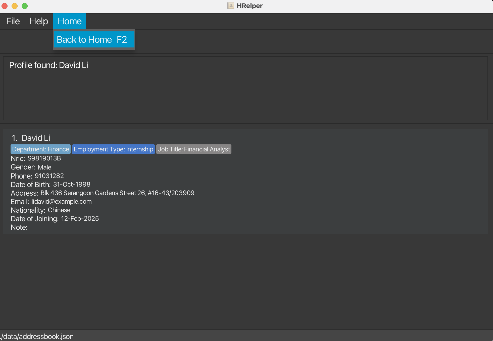

--------------------------------------------------------------------------------------------------------------------
## Hello HR! Meet HRelper
Welcome to HRelper, your trusted assistant for managing employee records with ease and speed.
We understand that working in HR means wearing many hats — from onboarding new hires and updating staff details to managing departments and tracking employment history. It can quickly become overwhelming.

That’s where HRelper comes in. Designed to simplify and streamline your workflow, HRelper helps you manage your employee database efficiently and confidently — so you can spend less time on spreadsheets and more time focusing on people.

--------------------------------------------------------------------------------------------------------------------
## Callouts Convention

The callout boxes below are used in documentation to enhance readability and provide important contextual information.

<box type="info" seamless>

**Info Box:**
Provides additional information or context.
</box>

<box type="tip" seamless>

**Tip Box:**
Offers helpful tips or suggestions.
</box>

<box type="warning" seamless>

**Caution Box:**
Alerts you to potential issues or problems that may arise.
</box>
--------------------------------------------------------------------------------------------------------------------

### Table of Contents

- [Quick start](#quick-start)
- [Features](#features)
    - [Viewing help](#viewing-help--help)
    - [Adding a person](#adding-a-person-add)
    - [Listing all persons](#listing-all-persons--list)
    - [Viewing a profile](#viewing-a-profile-view)
      - [Returning to home view](#returning-to-home-view)
    - [Editing a person](#editing-a-person--edit)
    - [Filtering by](#filtering-by-findby)
    - [Deleting a person](#deleting-a-person--delete)
    - [Clearing all entries](#clearing-all-entries--clear)
    - [Exiting the program](#exiting-the-program--exit)
    - [Saving the data](#saving-the-data)
    - [Editing the data file](#editing-the-data-file)
    - [Archiving data files](#archiving-data-files-coming-in-v20)
- [FAQ](#faq)
    - [Q1: Will my data be lost if I close the app?](#q1)
    - [Q2: Can I search by job title or department?](#q2)
    - [Q3: How do I transfer my data to another computer?](#q3)
- [Known issues](#known-issues)
- [Command summary](#command-summary)

--------------------------------------------------------------------------------------------------------------------
## Current HRelper Prototype Overview
The current version of the HRelper is a prototype designed to showcase its core functionality.   

* At present, the prototype is tailored to Singapore, meaning that phone numbers and NRICs are configured for Singapore-based operations.  
* Since this is just a prototype of how our HRelper works, in real world scenarios, we will customise the valid department list according to the company's needs. Each company should populate the valid department before using HRelper.
* Attributes marked with an asterisk (*) indicate that they are in their current form because they follow the structure of the prototype.

## Quick start

1. Ensure you have Java `17` or above installed in your Computer. 
   **Mac users:** Ensure you have the precise JDK version prescribed [here](https://se-education.org/guides/tutorials/javaInstallationMac.html).

1. Download the latest `.jar` file from [here](https://github.com/AY2425S2-CS2103T-F14-2/tp/releases).

1. Copy the file to the folder you want to use as the _home folder_ for HRelper.

1. Open a command terminal, `cd` into the folder you put the jar file in, and use the `java -jar hrelper.jar` command to run the application. 
   A GUI similar to the below should appear in a few seconds. Note how the app contains some sample data. 
   

1. Type the command in the command box and press Enter to execute it. e.g. typing **`help`** and pressing Enter will open the help window. 
   Some example commands you can try:

   * `list` : Lists all contacts with full attributes.

   * `add n/John Doe p/98765432 e/johnd@example.com ic/T0312345A g/Male d/02-Jan-2001 j/15-Apr-2025 nat/Singaporean a/311, Clementi Ave 2, #02-25/119278 t/Finance/Full-Time/Financial Analyst` : Adds a contact named `John Doe` to the Address Book.

   * `delete 3` : Deletes the 3rd contact shown in the current list.

   * `clear` : Deletes all contacts.
   
   * `view Lee` : Views the contact by their surname.
   
   * `edit 2 n/Betsy Crower`: Edits the name of the 2nd person to be `Betsy Crower`.
   
   * `findByDepartment Finance` : Lists all contacts in this specific department
   
   * `note`: add optional remarks to people in their address book and edit it if required. 

   * `exit` : Exits the app.

1. Refer to the [Features](#features) below for details of each command.

--------------------------------------------------------------------------------------------------------------------

## Features

**:information_source: Notes about the command format:** 

* Words in `UPPER_CASE` are the parameters to be supplied by the user. 
  e.g. in `add n/NAME`, `NAME` is a parameter which can be used as `add n/John Doe`.

* Parameters can be in any order. 
  e.g. if the command specifies `n/NAME p/PHONE_NUMBER`, `p/PHONE_NUMBER n/NAME` is also acceptable.

* Extraneous parameters for commands that do not take in parameters (such as `help`, `list`, `exit` and `clear`) will be ignored. 
  e.g. if the command specifies `help 123`, it will be interpreted as `help`.

* If you are using a PDF version of this document, be careful when copying and pasting commands that span multiple lines as space characters surrounding line-breaks may be omitted when copied over to the application.

### Viewing help : `help`

Shows a message explaning how to access the help page.

Format: `help`

### Adding a person: `add`

Adds a person to the address book.

Format: `add n/NAME p/PHONE_NUMBER e/EMAIL ic/NRIC g/GENDER d/DOB j/DATE OF JOINING nat/NATIONALITY a/ADDRESS/POSTAL CODE t/DEPARTMENT/EMPLOYMENTTYPE/JOBTITLE`

* Names are case-insensitive. The profile will automatically capitalise the first letter of each word and convert all other letters to lowercase.
* Phone numbers must be exactly 8 digits long and start with 6, 8, or 9.*
* NRIC should start with S, T, F, or G, followed by 7 digits, and end with a capital letter.*
* Gender is case-sensitive and will only take in Male, Female or Other.*
* Nationality follows a pre-defined set of common nationalities. In the rare case where a nationality is not specified, choose 'Other'.
* Tag fields (i.e. Department, Employment Type, Job Title) are case-insensitive. Additionally, certain short forms are valid for Department.

Examples:
* `add n/John Doe p/98765432 e/johnd@example.com a/John street, block 123, #01-01`
* `add n/David Li p/91031282 e/lidavid@example.com ic/S9819013B g/Male d/31-Oct-1998 j/12-Feb-2025 nat/Chinese a/Blk 436 Serangoon Gardens Street 26, #16-43 t/Finance/Internship/Financial Analyst`

### Listing all persons : `list`

Shows a list of all persons in the address book with full attributes.

Format: `list`

### Viewing a profile: `view`

Displays the full profile of an employee by matching their **full name** or **surname**.

Format: `view FULLNAME` or `view SURNAME`

* The search is **case-insensitive**.  e.g `hans` will match `Hans`
* ⚠️ Order matters for full names.  e.g. `Hans Bo` will not match `Bo Hans`
* Only the name is searched.
* **Exact word match only** - partial names won't be matched.  e.g. `Han` will not match `Hans`
* Persons matching the surname or full name will be returned (i.e. `OR` search). 
  e.g. `Bo` will return name with same surname  `Hans Bo`, `Ling Bo`   e.g. `Hans Bo` will return `Hans Bo`

Examples:
* `view David Li`

### Returning to Home View:

After viewing an employee’s profile, you can return to the main Home view, simply:

- **Click** on **Home → Back to Home** in the top menu bar

HRelper will return to the overview page and display all employees again, with a message:
**Returned to Home**

<table> <tr> <td align="center"><strong>Before returning to Home</strong>    </td> <td align="center"><strong>After returning to Home</strong>    </td> </tr> </table>

### Editing a person : `edit`

Edits an existing person in the address book.

Format: `edit INDEX [n/NAME] [p/PHONE] [e/EMAIL] [a/ADDRESS/POSTAL CODE] [t/TAG]…​`

* Edits the person at the specified `INDEX`. The index refers to the index number shown in the displayed person list. The index **must be a positive integer** 1, 2, 3, …​
* Square brackets [ ] represent optional fields
* At least one of the optional fields must be provided.
* Existing values will be updated to the input values.
* When editing tags, even if editing only one item out of all, you need to include all items

Examples:
*  `edit 1 p/91234567 e/johndoe@example.com` Edits the phone number and email address of the 1st person to be `91234567` and `johndoe@example.com` respectively.
*  `edit 2 n/Betsy Crower` Edits the name of the 2nd person to be `Betsy Crower`.
*  `edit 1 t/HR/Full-Time/HR Coordinator` Edits the tag of the 1st person to be `HR/Full-Time/HR Coordinator`.

### Filtering by: `findBy...`
Filters the contacts by their department, job title, or employment type.

#### `findByDepartment`
Format: `findByDepartment KEYWORD`

* Finds contacts who belong to departments that match the specified keyword
* Search is case-insensitive (e.g., "finance" will match "Finance")
* Accepts department short forms (e.g., "HR" will match "Human Resources")
* For partial matches, keyword must contain at least 3 consecutive letters of the department name
* Only alphabetic characters and the '&' symbol are allowed in department search terms

Examples:
* `findByDepartment Finance` returns all contacts in the Finance department
* `findByDepartment HR` returns all contacts in the Human Resources department
* `findByDepartment Acc` returns all contacts in the Accounting department
* `findByDepartment Sof` returns all contacts in the Software Development department

#### `findByJobTitle`
Format: `findByJobTitle KEYWORD`

* Finds contacts whose job titles match the specified keyword
* Search is case-insensitive
* Will match if the keyword matches a full word in the job title
* For partial matches, keyword must contain at least 3 consecutive letters of a word in the job title
* Only alphabetic characters are allowed in job title search terms

Examples:
* `findByJobTitle Engineer` returns all engineers
* `findByJobTitle Dev` returns all developers
* `findByJobTitle Coord` returns all coordinators

#### `findByEmploymentType`
Format: `findByEmploymentType EMPLOYMENT_TYPE`

* Finds contacts with the specified employment type
* Search must use exact employment type terms or their common variations
* Only alphabetic characters and hyphens are allowed in search terms
* Supported employment types: Full-Time, Part-Time, Contract, Internship

Examples:
* `findByEmploymentType Full-Time` returns all full-time employees
* `findByEmploymentType Part-Time` returns all part-time employees
* `findByEmploymentType Contract` returns all contractors

### Deleting a person : `delete`

Deletes the specified person from the address book.

Format: `delete INDEX`

* Deletes the person at the specified `INDEX`.
* The index refers to the index number shown in the displayed person list.
* The index **must be a positive integer** 1, 2, 3, …​

Examples:
* `list` followed by `delete 2` deletes the 2nd person in the address book.
* `findByDepartment Finance` followed by `delete 1` deletes the 1st person in the results of the `find` command.

### Adding a note : `note`

Adds a note to the specified person from the address book.
 
Format: `note INDEX [NOTE]`

* Adds a note to the person at the specified `INDEX`. The index refers to the position of the person in the currently displayed list on the GUI. The index **must be a positive integer** 1, 2, 3, …​
* Square brackets [ ] represent optional fields
* `NOTE` can be any string input 
* Existing note value will be updated to the input value

Examples:
* `note 1 they/them`

To update field to an empty string i.e. pseudo-delete 
* `note 1`

### Clearing all entries : `clear`

Clears all entries from the address book.

Format: `clear`

### Exiting the program : `exit`

Exits the program.

Format: `exit`

### Saving the data

HRelper data are saved in the hard disk automatically after any command that changes the data. There is no need to save manually.

### Editing the data file

HRelper data are saved automatically as a JSON file `[JAR file location]/data/hrelper.json`. Advanced users are welcome to update data directly by editing that data file.

:exclamation: **Caution:**
If your changes to the data file makes its format invalid, HRelper will discard all data and start with an empty data file at the next run. Hence, it is recommended to take a backup of the file before editing it. 
Furthermore, certain edits can cause the AddressBook to behave in unexpected ways (e.g., if a value entered is outside of the acceptable range). Therefore, edit the data file only if you are confident that you can update it correctly.

### Archiving data files `[coming in v2.0]`

_Details coming soon ..._

--------------------------------------------------------------------------------------------------------------------

## FAQ

### Q1: What happens if I close the app? Will my data be lost?
**A**: No worries! HRelper automatically saves all your data after every change. When you reopen the app, your latest data will still be there.

### Q2: Can I search for employees by job title or department? 
**A**: Yes! Use commands like `findByDepartment`, `findByJobTitle`, or `findByEmploymentType`.
Example: `findByDepartment Marketing` will show all employees in the Marketing department.

### Q3: How do I transfer my data to another computer? 
**A**: Install the app in the other computer and overwrite the empty data file it creates with the file that contains the data of your previous HRelper home folder.

--------------------------------------------------------------------------------------------------------------------
## Known issues

1. **When using multiple screens**, if you move the application to a secondary screen, and later switch to using only the primary screen, the GUI will open off-screen. The remedy is to delete the `preferences.json` file created by the application before running the application again.
2. **If you minimize the Help Window** and then run the `help` command (or use the `Help` menu, or the keyboard shortcut `F1`) again, the original Help Window will remain minimized, and no new Help Window will appear. The remedy is to manually restore the minimized Help Window.

--------------------------------------------------------------------------------------------------------------------

## Command summary

Action | Format, Examples
--------|------------------
**Add** | `add n/NAME p/PHONE_NUMBER e/EMAIL ic/NRIC g/GENDER d/DOB j/DATE OF JOINING nat/NATIONALITY a/ADDRESS/POSTAL CODE t/DEPARTMENT/EMPLOYMENTTYPE/JOBTITLE` e.g., `add n/John Doe p/98765432 e/johnd@example.com ic/T0312345A g/Male d/02-Jan-2001 j/15-Apr-2025 nat/Singaporean a/311, Clementi Ave 2, #02-25/119278 t/Finance/Full-Time/Financial Analyst`
**Clear** | `clear`
**Delete** | `delete INDEX`  e.g., `delete 3`
**Edit** | `edit INDEX [n/NAME] [p/PHONE_NUMBER] [e/EMAIL] [g/GENDER] [d/DOB] [j/DATE OF JOINING] [nat/NATIONALITY] [a/ADDRESS/POSTAL CODE] [t/DEPARTMENT/EMPLOYMENTTYPE/JOBTITLE]`  e.g.,`edit 2 n/James Lee e/jameslee@example.com`
**Find by Department** | `findByDepartment KEYWORD`  e.g., `findByDepartment HR`, `findByDepartment Fin`, `findByDepartment Information Technology` |
**Find by Job Title** | `findByJobTitle KEYWORD`  e.g., `findByJobTitle Engineer`, `findByJobTitle Dev`, `findByJobTitle Coordinator` |
**Find by Employment Type** | `findByEmploymentType EMPLOYMENT_TYPE`  e.g., `findByEmploymentType Full-Time`, `findByEmploymentType Contract` |
**Note** | `note INDEX NOTE` e.g. note 1 he likes aadvarks 
**List** | `list`
**Help** | `help`
**View** | `view FULLNAME [SURNAME]`  e.g., `view Alex Yeoh` or `view Yeoh`
