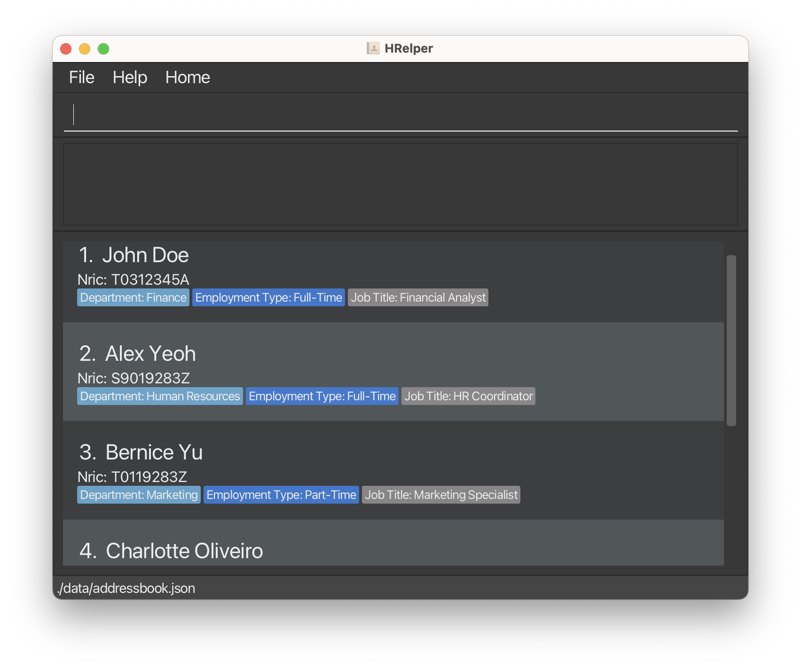

**HRelper** is a desktop Human Resource (HR) management application designed to streamline the way users manage employee contact and profile details. Built for efficiency and speed, HRelper combines the familiarity of a Graphical User Interface (GUI) with the power and precision of a Command Line Interface (CLI).

* If you are interested in using HRelper, head over to the [_Quick Start_ section of the **User Guide**](UserGuide.html#quick-start).
* If you are interested about developing HRelper, the [**Developer Guide**](DeveloperGuide.html) is a good place to start.

**Acknowledgements**

* Libraries used: [JavaFX](https://openjfx.io/), [Jackson](https://github.com/FasterXML/jackson), [JUnit5](https://github.com/junit-team/junit5)
